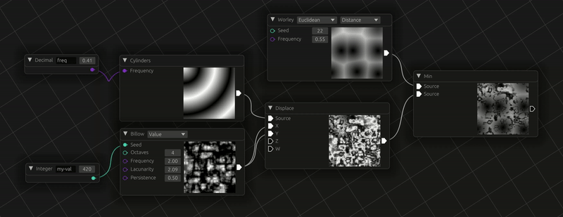

# `noise_gui`

[](https://github.com/attackgoat/noise_gui)
[](https://crates.io/crates/noise_gui)
[](https://docs.rs/noise_gui/latest/noise_gui/)
[](https://github.com/attackgoat/noise_gui/actions/workflows/main.yml)
[](https://github.com/attackgoat/noise_gui/blob/master/LICENSE-MIT)
[](https://github.com/attackgoat/noise_gui/blob/master/LICENSE-APACHE)

---

A graphical user interface for [Noise-rs](https://github.com/Razaekel/noise-rs).

> [!TIP]
> `noise_gui` runs on Linux/Mac/Windows desktops and [**the web**](https://attackgoat.github.io/noise_gui/)!



## Features:

- [x] Support for all [Noise-rs](https://github.com/Razaekel/noise-rs) `NoiseFn` implementations
- [ ] Allow zoom/pan on preview images
- [x] Allow saving the graph project to a file[^1]
- [x] Allow noise function export[^1]
- [ ] Automatic `NoiseFn` cached values
- [ ] Subroutine blocks, comment blocks, node descriptors, etc.
- [x] WASM support using [Trunk](https://trunkrs.dev/)

[^1]: Available on desktop only

> [!WARNING]
> `noise_gui` is currently in the proof-of-concept phase and may contain bugs and missing features.
> The examples are not currently working and need to be updated because of the latest changes to
> the serialization format.

## Development Dependencies

Ubuntu 22.04:

```bash
sudo apt install libgtk-3-dev
```

Browser:

```bash
rustup target add wasm32-unknown-unknown
cargo install trunk
```

## How To Run Locally

Desktop:

```bash
cargo run
```

Browser:

```bash
trunk serve --open
```

## Noise Function Export

Completed noise graphs may be exported (_right-click on any node_). The output file is `.ron` format
and may be deserialized for use in your programs.

Once deserialized into an `Expr` instance you may replace any decimal or integer values using their
name and the `Expr::set_f64` and `Expr::set_u32` functions. Note that node names do not have to be
unique and that all nodes sharing the provided name will be updated. The `Expr::noise` function may
be used to retrieve a Noise-rs `NoiseFn` implementation.

See the example for more details:

```bash
cargo run --example read_file
```
