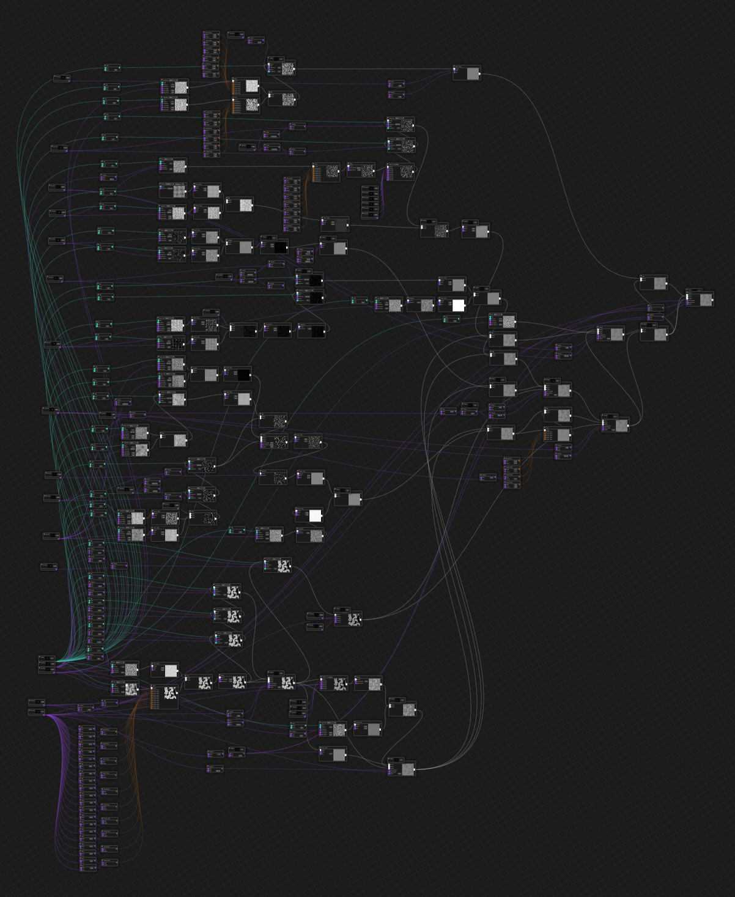

# Examples

## Complex Planet (stress test)

The included `complexplanet.ron` file is a project file which may be opened in the desktop app. It
is a recreation of
[`complexplanet.rs`](https://github.com/Razaekel/noise-rs/blob/develop/examples/complexplanet.rs)
from [Noise-rs](https://github.com/Razaekel/noise-rs).

Opening the project will take a few minutes while all the preview images are recreated. Any changes
to the final nodes will also cause lots of computation and slow down the UI a little, although it
should remain responsive.

> [!NOTE]
> Future changes to `noise_gui` will focus on making files of this size easier to understand and
> edit.

Once loaded it should look like this:

